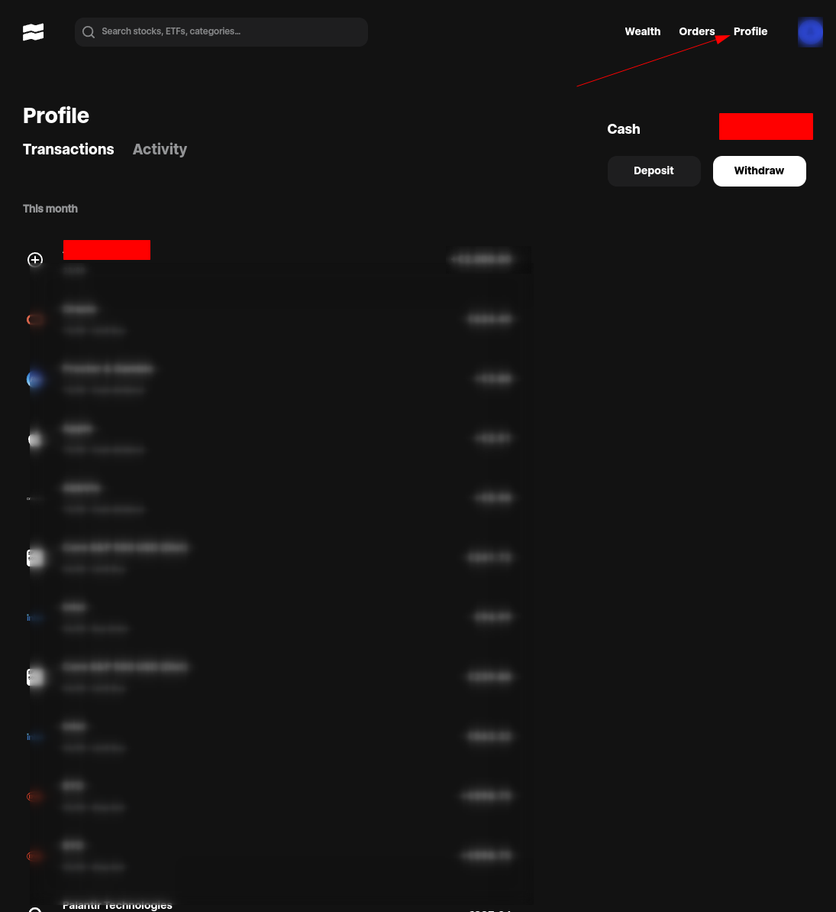
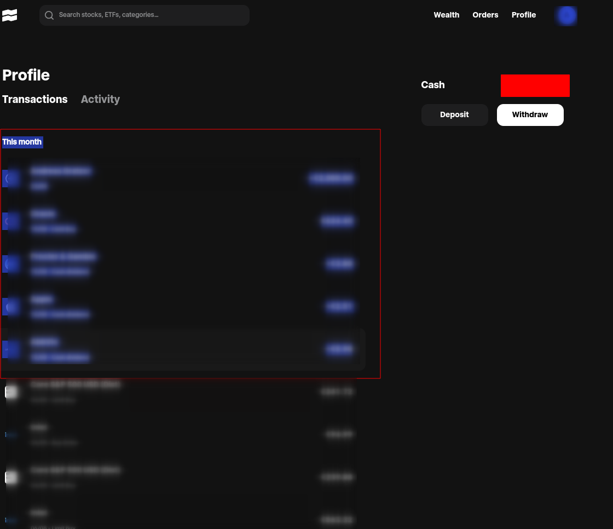

# traderepublic-transaction-parser
> Convert transactions copied from your traderepublic account into csv format for analysis.

Example input:
``` text
This month
Oracle
Oracle
15/08 - Limit Buy

€1.40
...
```
Generated output
``` text
Date,Tag,Type,Currency,Amount_Prefix,Amount_Absolute
2024-08-15,Oracle,Limit Buy,€,-,1.4
...
...
```


## How-To

### Browse to "Profile" page and select "Transaction" tab


### Mark from top-left "This month" to bottom-right


### Paste to file
> e.g. examples/transactions-traderepublic.txt

### Check config file
> config/config.yaml

### Run example
> examples/parser_example.go
### Check generated csv-file